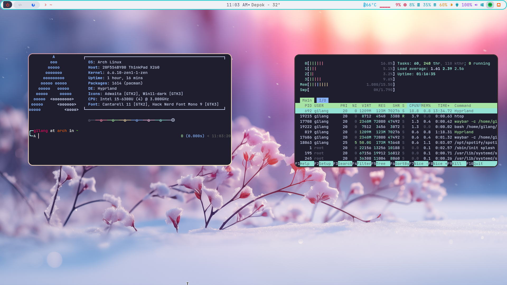
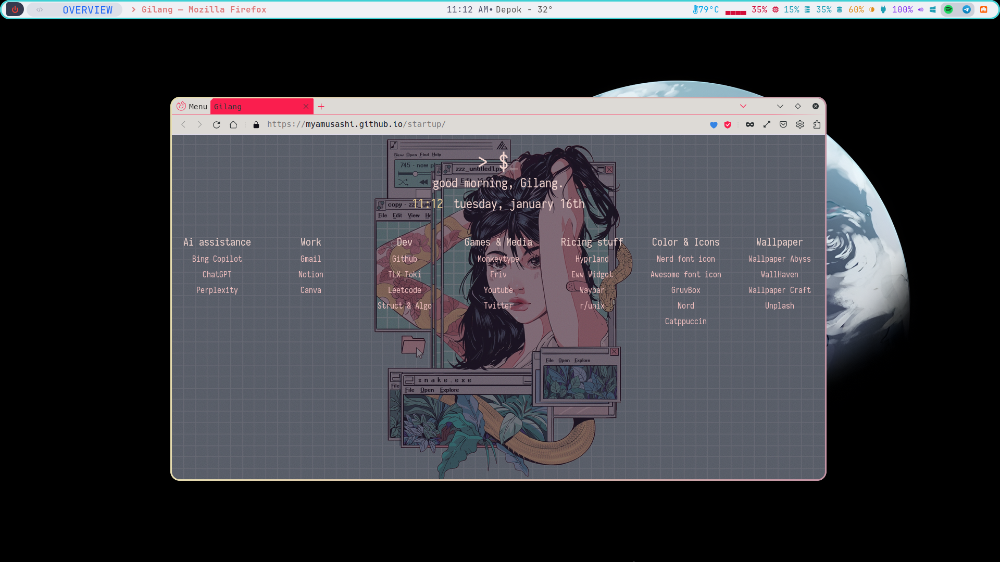
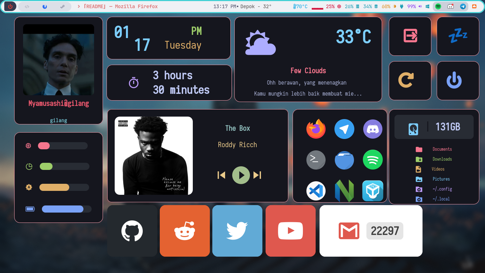

# Hyprland-waybar

My dotfiles, using hyprland and waybar

## Screenshots

 

 
> ⚠️ **Dashboard**: This eww dashboard is for 1366x768 desktop. If you want to use 1920x1080, check this one. ["Eww dashboard"](https://github.com/adi1090x/widgets) 

## Dependencies

WM/DE : [Install hyprland](https://wiki.hyprland.org/Getting-Started/Installation/) 

Bar : [Install waybar](https://github.com/Alexays/Waybar) 

Dashboard : [Install eww](https://elkowar.github.io/eww/)

Wallpaper : [Install swww](https://github.com/LGFae/swww)

Clipboard : [Install wl-clipboard](https://github.com/bugaevc/wl-clipboard)  

Launcher powermenu & apps : [Install rofi](https://github.com/davatorium/rofi)

Applications launcher for screenshot selector : [Install fuzzel](https://codeberg.org/dnkl/fuzzel) 

Browser : [Install firefox](https://www.mozilla.org/en-US/firefox/new/)

Lock : [Install swaylock-effects](https://github.com/mortie/swaylock-effects)

Image viewer : [Install loupe](https://archlinux.org/packages/extra/x86_64/loupe/) 

play music : [Install playerctl](https://github.com/altdesktop/playerctl) 

Screenshot : [Install grim](https://git.sr.ht/~emersion/grim/refs/v1.4.1) & [slurp](https://github.com/emersion/slurp)  

Terminal file manager : [Install lf](https://github.com/gokcehan/lf) 

Shell : [Install fish](https://github.com/fish-shell/fish-shell) 

Terminal : [Install kitty](https://sw.kovidgoyal.net/kitty/binary/)

Notifications : You can use [dunst](https://github.com/dunst-project/dunst) or [mako](https://github.com/emersion/mako)

Code edtior : [Visual studio code](https://code.visualstudio.com/download) or [Lunarvim](https://www.lunarvim.org/docs/installation)  

File manager : [Install nautilus](https://archlinux.org/packages/extra/x86_64/nautilus/)

#### Hyprland plugins
Hyprland overview, for more information see this page [plugins](https://github.com/DreamMaoMao/hycov) 

## Optionals

Spotify : you can install spotify from the official [spotify](https://www.spotify.com/id-id/download/linux/?_ga=2.43341734.2058169428.1705407015-1022308288.1705407014) 
and if you want to block some ads install this [spotify adblock](https://github.com/abba23/spotify-adblock) 

## Installation

1. git clone https://github.com/myamusashi/Hyprland-waybar.git
2. cd Hyprland-waybar 
3. cp -rf .config/* ~/.config/ && cp -rf .local/share/fonts ~/.local/share/ && cp .local/share/icons ~/.local/share/ 

> ℹ️ **Waybar**: I have two waybar settings, the first is the default waybar (one_bar) and the second is double_bar which has 2 bars at the top and 
bottom. If you want to use double_bar, install waybar with this instead [waybar](https://aur.archlinux.org/packages/waybar-hyprland-cava-git)

## Changes wallpapers
To changes wallpapers you have three options

1. Use the keybinds: ALT + SHIFT + S. This option can change your monitor's wallpaper depending on the wallpaper selected, 
   and if you have two or more monitors, this option will change all your monitors' wallpapers.

2. Use GUI version [Check this one](https://github.com/anufrievroman/waypaper)

3. Use the Waybar icons “” you can click to change wallpapers. If it doesn’t work, check your monitor's output using ‘xrandr’ or ‘hyprctl monitors', and modify this file: 
   "$HOME/.config/hypr/scripts/change-wallpapers” if you never use swww before check the --help for more information

## Keybinding

